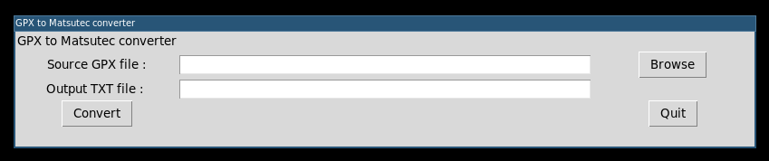
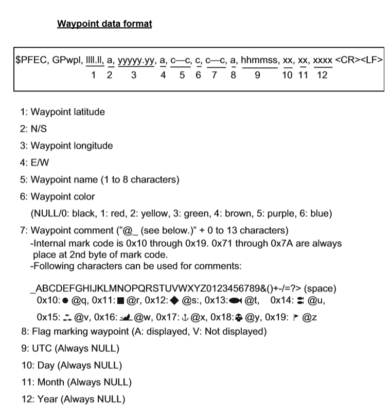

# Convert GPX file to a text file suitable for Matsutec-brand GPS

## Standalone executables with GUI

Standalone executable files are available in the `gui_executables` directory. These launch a minimalistic graphical interface for ease of use. You can also launch the GUI script with python. The GUI performs exactly the same tasks as the python script (in fact importing the script as a module).



## Script install

* Clone the repo
* Install python3 if needed
* Install the needed dependencies (e.g. with `pip3 install xmltodict`) :
    * xmltodict
    * json
    * argparse
    * tkinter (GUI only)
* Run the script, all arguments are described in the help message : `./gpx_to_matsutec.py -h`, for instance :
```
./gpx_to_matsutec.py -i sample.gpx -o sample.txt
```

## Waypoint source (GPX file)

The script takes a GPX file as input. GPX files can be generated with software like [OpenCPN](https://opencpn.org/). The script currently only parses the waypoint name and GPS coordinates. All other attributes are ignored.

## Waypoint formatting (automatic shape and color)

The script parses the waypoint name in order to determine shape and color for better visibility on the GPS screen.

Waypoints are treated as follows :
* Cardinals : waypoint name ends with N, S, W or E (depending on directions), blue sideways square
* Lateral buoys : end with either B or T (bâbord/tribord, french for port and starboard), red or green flag respectively
* Lighthouses : end with P, brown point
* Special marks : end with SP, yellow flag
* Isolated danger : endd with DG, red square
* Coastal marks (can be used to "draw" the coast line or unmarked danger) : start with TC ("trait de côte"), red skull
* DST (french for TSS) : starts with DST, purple birds (or something like that)
* ORTHO : black flag

Waypoints that don't match any of those patterns are shaped as black dots.

Here is a general doc on how waypoint formatting works on Matsutec GPS :



### Customize the waypoint format

Not implemented, but you can fork the script and modify the [`_set_color_shape`](https://github.com/Yoliste/gpx_to_mini_gps/blob/main/gpx_to_matsutec.py#L56) method to taste.

## Import the waypoint file to a Matsutec GPS

Serial connection (e.g. with screen, minicom or Putty), baud rate 38400.

## Features to be added

This script could theoretically support other brands of GPS but I don't have those, but if you provide me with specs of the needed output I can try to look into it.
